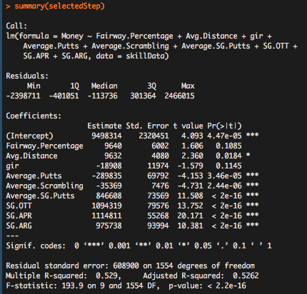
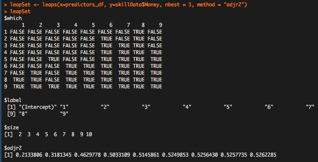

## Introduction

Does the old saying, "drive for show, putt for dough" still hold true in professional golf? Bryson Dechambeau, a polarizing figure widely viewed as golf's "mad scientist", seems to disagree. He's decided to put on over fifty pounds of (mostly) muscle and is now driving the ball a record average of 344.4 yards in the 2021 season, outdriving all of his peers by over 13 yards. While his absurd diet (7 protein shakes a day?!) and body transformation are unique, they embody a larger trend in professional golf: PGA tour professionals are chasing distance like never before. Many debates have stemmed from this trend, many focused on limiting distance through equipment regulations. I've decided to tackle this question on distance with a regression-driven analysis on PGA tour data from 2010-2018.

## One key assumption about "Success"

Athletic success can be defined in many ways, especially in a sport like golf. After all, what's more impressive: winning one major event, or coming close at five majors? While careers are most remembered for wins in Major Championships and brief stretches of dominance, for the purpose of this analysis I've decided to define success as money. I've chosen money because the purse of a tournament is a function of a few things, including (1) how big a tournament is, (2) how close to winning a player was, and (3) how consistently a player makes the cut. I will post a follow-up to this post that considers success differently by exclusively looking at wins and top tens.

## Are golfers getting longer?

When considering the impact of distance on today's PGA tour, it's important to first consider if the data supports the very existence of the trend. After scraping data from the PGA tour website from 2010-2018, first I had to clean it by converting NA's to zero and ensuring that all data types were the same. The following code achieved this, creating two datasets: one including all players' seasons from 2010-2018, and another that takes away outlier seasons. Removing outliers evens the positive skewness of the data and allows for an analysis of more-general trends on tour.

```r
pgaData$Money <- as.numeric(pgaData$Money)
pgaData$Wins <- as.numeric(pgaData$Wins)
pgaData$Wins[is.na(pgaData$Wins)] <- 0
pgaData$Top.10 <- as.numeric(pgaData$Top.10)
pgaData$Top.10[is.na(pgaData$Top.10)] <- 0
outliers <- boxplot(pgaData$Money, plot=FALSE)$out
noOutlierPGAData<- pgaData[-which(pgaData$Money %in% outliers),]
```

Next, I grouped the PGA data by year, found the mean distance by year, and plotted it.

```r
yearData <- pgaData %>% group_by(Year)
distanceByYear <- summarise_at(yearData, vars(Avg.Distance), list(name = mean))
plot(distanceByYear, ylab = "Avg Distance (Yards)", pch = 16, type = "b")
title("Average Distance by Year")
```


As you can see, there is a definite year-over-year trend emerging. The PGA tour players gained an average of ten yards between 2010 and 2018, with increases occurring every year between 2013 and 2018. The pros certainly are getting longer due to a combination of fitness and equipment.

## Are they sacrificing accuracy to achieve these distances?

Are pro golfers simply swinging out of their shoes, or is this gain in distance separated from a decrease in accuracy? I used a very similar process to answer this question, summarizing the same grouped data using fairway percentage as the variable.

```r
accuracyByYear <- summarise_at(yearData, vars(Fairway.Percentage), list(name = mean))
plot(accuracyByYear, ylab = "Fairway Accuracy (%)", pch = 16, type = "b")
title("Fairway Accuracy by Year")
```


This trend is a bit more tenuous than the gain in distance. It appears as though accuracy has decreased over time, but not by much. There has been just a ~1.5% decrease in fairway accuracy between 2010 and 2018, though if 2010 is removed that number falls much closer to zero. In any case, a 1.5% decrease in fairway accuracy hardly matches the ~3.5% increase in driving distance over the same time period. This means that PGA tour professionals are improving off the tee over time.

## Why this focus on distance?

Pro golfers have a finite amount of practice and gym time, so they need to pick how to spend it wisely. This emphasis on distance means that professionals see any marginal increases in distance and ball-striking as vital to their success. To examine this claim, I've decided to focus on the metric, Strokes Gained (SG) Off the Tee. SG Off the Tee is strongly correlated to distance, with an r value above .65 compared to an r value of around .2 for fairway accuracy. 

As an initial test, I've checked the correlation coefficient of each SG variable. SG approach had the strongest individual correlation, followed closely by SG off the tee, with SG putting third and SG around the greens last. This initial test suggested that approach could matter more than off-the-tee, but still showed that ball-striking is more closely correlated to earnings than short game.

The best way to understand why pro golfers view distance as so important is to build a model, inputting skills, that outputs expected earnings. So, I started off by narrowing down the full PGA data with outliers removed to only include skill data and money, setting all NA's to zero. I also split this into response, and explanatory variables.

```r
skillData <- noOutlierPGAData[, !names(pgaData) %in% c("Top.10", "Wins", 
                                 "Rounds", "Points", "Average.Score", "Average.SG.Total", "Year", "Player.Name") ]
skillData[is.na(skillData)] <- 0

response_df <- noOutlierPGAData['Money']  # Y variable
predictors_df <- noOutlierPGAData[, !names(pgaData) %in% c("Money", "Top.10", "Wins", 
                                                  "Rounds", "Points", "Average.Score", "Year", "Average.SG.Total", "Player.Name") ]  # X variables
```

I used two methods in my model selection: a stepwise regression, and the leaps best-subsets package. Stepwise regressions are particularly useful for selection of explanatory variables in a multiple linear regression. A stepwise regression works by adding or removing variables one-by-one in order to assess each variable's statistical significance.

```r
lmMod <- lm(Money ~ . , data = skillData)
selectedStep <- step(lmMod)
summary(selectedStep)
```


This stepwise regression indicated that the four strongest variables, by far, are each of the SG variables. This is because Strokes Gained as a statistic takes a lot into account by already comparing one's performance to the average pro. For example, SG Off the Tee is calculated by taking into account the average score on a hole before and after the drive, taking into account how far the pro has left after the drive and the lie that they've left themself in. This uses fairway percentage and driving distance and weights them against the average tour pro. Interestingly, total putts has a negative coefficient. Though this seems counterintuitive, this must be because the easiest way to have a low number of putts is to miss greens in regulation and be good  at chipping. 

Leaps is a best-subset regression that tests different combinations of variables to find the best possible model for each number of desired explanatory variables. Leaps confirmed that the four SG variables are to be used in our model, with no need for any others.

```r
leapSet <- leaps(x=predictors_df, y=skillData$Money, nbest = 1, method = "adjr2") 
leapSet
```


This output shows that the adjusted R-squared value increases drastically for the first four variables included all the way to .503, then only increases incrementally for each variable after. It has also pinpointed that the best possible multiple linear regression with four variables includes all four SG variables.

This gives us our model: Money ~ a + b(SG Putting) + c(SG Off the Tee) + d(SG Approach) + e(SG Around the Greens). To find a, b, c, d, and e, I used a summary function.

```r
bestMod <- lm(Money ~ Average.SG.Putts + SG.OTT + SG.APR + SG.ARG, data = skillData)
summary(bestMod)
```


From this, we get our coefficient values. This gives us our model:

Money ~ 1,143,273 + 990,649(SG Putting) + 1,102,506(SG Off the Tee) + 978,983(SG Approach) + 859,835(SG Around the Greens)

This means that every one stroke gained off the tee per round yields an average increase of $1,102,506 per year, while a stroke gained putting yields a $990,649 increase. Our model has an adjusted r-squared value of .5033, which means that about 50% of the variation in this dataset can be explained by this model. 


This normal Q-Q plot looks pretty good. For a linear regression, it ideally looks perfectly linear with a slope of one, since it plots quartiles of results against one another.

## Wait a second: aren't all strokes equal?

While a stroke gained driving equals a stroke gained around the greens during the course of a round, these are statistics compiled over the course of an entire season. So, not all strokes-gained are equal since they mean different levels of volatility and consistency. After all, a player earns more winning an event than they do in several top-tens. This means that you'd rather be the type of player who is a lights-out ball-striker and just needs a lucky putting week, than a consistently strong putter who cannot achieve the same numbers off the tee and in approach.

To illustrate this, here are plots of SG off the tee and SG putting against money. The red line is this model's expectation of money earned as each respective variable changes, keeping all other constant.

```r
options(scipen=7)
plot(Money ~ SG.OTT, data = skillData, pch = 16, cex = .3, xlab = "Strokes Gained Off the Tee", ylab = "Money")
abline(bestMod, col = "red", lwd = 2)
title("Strokes Gained Off the Tee vs Money")

plot(Money ~ Average.SG.Putts, data = skillData, pch = 16, cex = .5, xlab = "Strokes Gained Putting", ylab = "Money")
abline(bestMod, col = "red", lwd = 2)
title("Strokes Gained Putting vs Money")
```


The increased slope of the regression in the SG off the tee plot relative to the SG putting plot reflects the greater coefficient of SG off the tee. This illustrates how every stroke gained off the tee means more expected earnings than every stroke gained putting.

To drive this point home, pretend we're building a pro. Name him Zedd. Zedd is a good player - on average, he has one total stroke gained on the field. How would distributing this stroke gained differently impact his expected earnings?

Consider five cases. In the first four, Zedd gets one stroke gained in each of the four strokes gained categories, and zero in the other three (meaning he is average). These will be labelled as OTT, Putt, APR, and ARG. In the last, distribute that stroke evenly across all four categories, labelled Even. Here are the 95% confidence intervals from each case:

```r
driverData <- data.frame(SG.OTT = 1, SG.ARG = 0, Average.SG.Putts = 0, SG.APR = 0 )
putterData <- data.frame(SG.OTT = 0, SG.ARG = 0, Average.SG.Putts = 1, SG.APR = 0 )
approachData <- data.frame(SG.OTT = 0, SG.ARG = 0, Average.SG.Putts = 0, SG.APR = 1 )
chipData <- data.frame(SG.OTT = 0, SG.ARG = 1, Average.SG.Putts = 0, SG.APR = 0 )
evenData <- data.frame(SG.OTT = .25, SG.ARG = .25, Average.SG.Putts = .25, SG.APR = .25)

driverPred <- predict(bestMod, newdata = driverData, type = "response", interval = "confidence")
putterPred <- predict(bestMod, newdata = putterData, type = "response", interval = "confidence")
approachPred <- predict(bestMod, newdata = approachData, type = "response", interval = "confidence")
chipPred <- predict(bestMod, newdata = chipData, type = "response", interval = "confidence")
evenPred <- predict(bestMod, newdata = evenData, type = "response", interval = "confidence")

varNames <- c("OTT", "Putt", "APR", "ARG", "Even")
preds <- c(driverPred[1], putterPred[1], approachPred[1], chipPred[1], evenPred[1])
mins <- c(driverPred[2], putterPred[2], approachPred[2], chipPred[2], evenPred[2])
maxes <- c(driverPred[3], putterPred[3], approachPred[3], chipPred[3], evenPred[3])
  
df <- data.frame(id=varNames, min=mins , max= maxes)

ggplot(df, aes(x=id))+
  geom_linerange(aes(ymin=min,ymax=max),linetype=2,color="black")+
  geom_point(aes(y=min),size=3,color="red")+
  geom_point(aes(y=max),size=3,color="red")+
  geom_point(aes(y= preds),size = 3, color = "black")+
  theme_bw() +
  ggtitle("95% Confidence Intervals by Player Type") +
  xlab("Player Type") +
  ylab("Money")
}
```


It appears that Zedd would be best off if we distributed that entire stroke to his driver and off the tee skills, leaving him average at everything else. Even his fifth percentile outcome would be better than the average outcome of all others. 

## Wrap-up and future questions

With this in mind, the recent surge in distance makes a lot of sense. After all, distance is so achievable. Assuming your swing mechanics stay similar, simply spending more time working on strength and flexibility almost guarantees an increase in distance. The same cannot be said for putting, in which everything has to go right for the ball to make it in the hole. More practice putting doesn't always guarantee that you'll make more putts.

I want to revisit this question at some point looking at different types of models, and also considering a different metric of success. Which skills best predict who will win the most events? How about most top-tens? Is there a better regression to use than a multiple linear regression?
