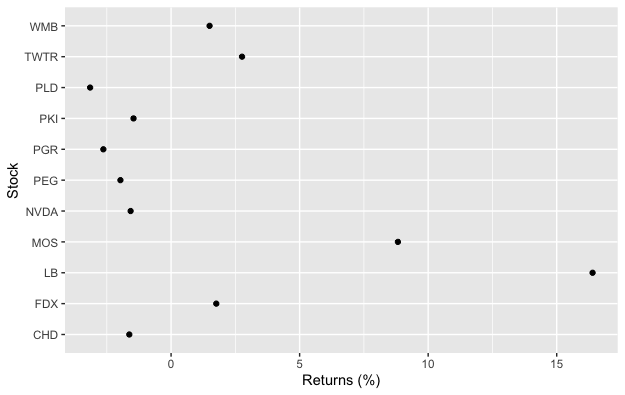
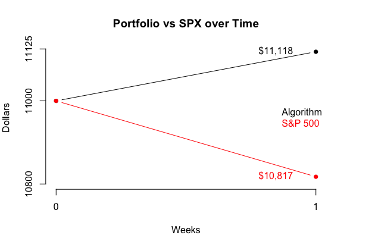

I've written an R program that uses Moving Average ratios weighted by Relative Strength Index to find large-cap stocks with strong momentum at optimal buying times. In a weekly blog series, I will give my program's "pick of the week" in addition to its favorite stock from every other GICS sector. Every post will update how my stocks have performed relative to indices, a strong indicator of success.

## Recap

Week one was a huge success, largely due to huge weeks from L Brands (LB) and The Mosaic Company (MOS). Fedex, my algorithm's pick of the week, rose over a percentage point on optimism that heightened demand will continue through 2021. Just six of eleven stock picks found themselves in the negative for the week, despite the S&P 500 declining 1.66%. Here's how the individual stocks performed:

To track this algorithm, I've decided to start with $11,000 split evenly between the eleven GICS sectors. Each week, the value of the portfolio will be calculated and redistributed evenly between the eleven new stocks. After week one, here is how my algorithm's portolio stands as compared to the S&P 500:

The portfolio generated by this algorithm found itself up 1.06% this week and made $118.20, as compared to SPX's $182.60 loss. On to week two!

## Pick of the week: Quanta Services Inc (PWR)

My algorithm's pick of the week is Quanta Services Inc, an Industrial stock that provides infrastructure services for electric power, pipeline, and communications industries. Quanta has performed strongly YTD, finding itself up over 40%. Since achieving a golden cross at the end of July, this stock has been on an absolute tear and seen its 200-day and 50-day moving averages widen. At its earnings call three weeks ago, Quanta outperformed earnings estimates by 26.1% and grew by 22.8% year over year. Its RSI has pulled back below 60 which could signal a strong short-term trend.

## Information Technology: Nvidia Corporation (NVDA)

## Health Care: IDEXX Laboratories, Inc (IDXX)

## Consumer Discretionary: Best Buy Co Inc (BBY)

## Communication Services: Netflix Inc (NFLX)

## Financials: Progressive Corp (PGR)

## Consumer Staples: Costco Wholesale Corporation (COST)

## Utilities: American Electric Power Company Inc (AEP)

## Real Estate: Prologis Inc (PLD)

## Materials: Freeport-McMoRan Inc (FCX)

## Energy: Williams Companies Inc (WMB)

Disclaimer: We are not registered as a securities broker-dealer or an investment adviser either with the U.S. Securities and Exchange Commission (the “SEC”) or with any state securities regulatory authority. We are neither licensed nor qualified to provide investment advice. Do not base any investment decision upon any material found on this website.