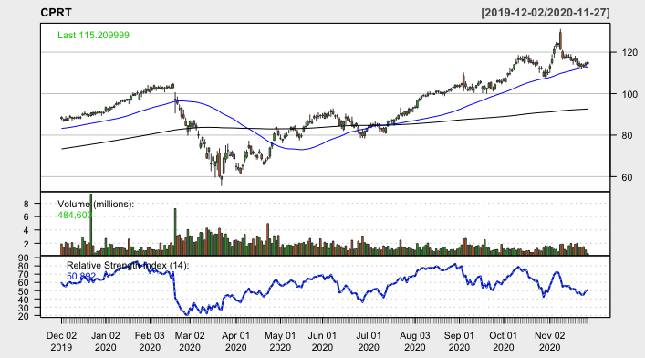

I've written an R program that uses Moving Average ratios weighted by Relative Strength Index to find large-cap stocks with strong momentum at optimal buying times. In a weekly blog series, I will give my program's "pick of the week" in addition to its favorite stock from every other GICS sector. Every post will update how my stocks have performed relative to indices, a strong indicator of success.

## Recap

Week two was another success, carried by a huge week from Freeport-McMoran Inc. Quanta, my algorithm's pick of the week, rose over three percentage points. Two stocks, Best Buy and Progressive, had very poor weeks which weighed down my algorithm's performance. Best Buy pulled back despite beating earnings estimates by $0.36 per share. Here's how each individual stock performed:

To track this algorithm's overall performance, I started with $11,000 split evenly between the eleven GICS sectors. Each week, the value of the portfolio will be calculated and redistributed evenly between the eleven new stocks. After week two, here is how my algorithm's portolio stands as compared to the S&P 500:

The portfolio generated by this algorithm found itself up 1.38% this week and made $152.09, as compared to SPX's 1.77% gain. Overall, my portfolio is up 2.45% while the S&P500 has traded nearly flat.

## Pick of the week: Gap Inc (GPS)

My algorithm's pick of the week is Gap Inc, a Consumer Discretionary stock that is a well-known clothing retailer. Gap has performed well YTD, finding itself up approximately 17%. Since bottoming in late-March at just over $5, this stock has been on an absolute tear, over quintupling from its lows. Gap pulled back after its earnings call last week which suggested its stock price had overgrown its financials. Optimism around Gap stems from growth in its Old Navy and Athleta lines. Its RSI has pulled back sharply to below 60, which could signal a strong short-term trend.

## Information Technology: Salesforce.com, Inc (CRM)

## Health Care: Mettler-Toledo International Inc (MTD)

## Communication Services: Twitter Inc (TWTR)

## Financials: SVB Financial Group (SIVB)

## Industrials: Copart, Inc (CPRT)

## Consumer Staples: Estee Lauder Companies Inc (EL)

## Utilities: AES Corp (AES)

## Real Estate: Ventas, Inc (VTR)

## Materials: Air Products & Chemicals, Inc (APD)

## Energy: Williams Companies Inc (WMB)

Disclaimer: We are not registered as a securities broker-dealer or an investment adviser either with the U.S. Securities and Exchange Commission (the “SEC”) or with any state securities regulatory authority. We are neither licensed nor qualified to provide investment advice. Do not base any investment decision upon any material found on this website.