I've written an R program that uses Moving Average ratios weighted by Relative Strength Index to find large-cap stocks with strong momentum at optimal buying times. In a weekly blog series, I will give my program's "pick of the week" in addition to its favorite stock from every other GICS sector. Every post will update how my stocks have performed relative to indices, a strong indicator of success.

## Recap

Week four saw a minor loss of .2%, as compared to the S&P's loss of .8%. Gap, my algorithm's pick of the week, had a poor week, falling  over two percent. Seven of the eleven picks were profitable on the week, the strongest being COG with a weekly gain of over three percent. Here's how each individual stock performed:

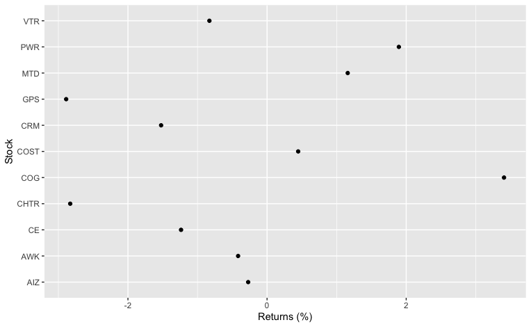

To track this algorithm's overall performance, I started with $11,000 split evenly between the eleven GICS sectors. Each week, the value of the portfolio will be calculated and redistributed evenly between the eleven new stocks. After week three, here is how my algorithm's portolio stands as compared to the S&P 500:

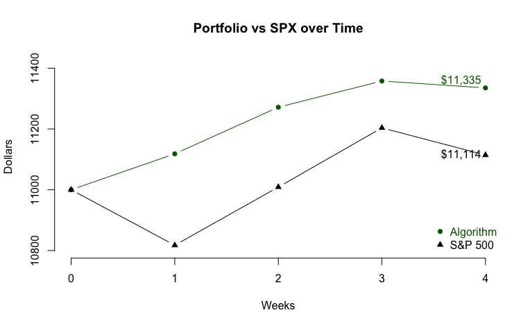

The portfolio generated by this algorithm found itself down .2% this week and lost $22, as compared to SPX's .8% and $88 loss. Overall, my portfolio is up 3.01% while the S&P 500 is up 1.03%.

## Pick of the week: Salesforce, Inc (CRM)

My algorithm's pick of the week is Salesforce, Inc, an Information Technology stock that recently acquired the Communications company, Slack (WORK). CRM has performed quite strongly until pulling back several percent after acquiring Slack due to concerns over its valuation. Present optimism around CRM stems from its recent acquisition, and also its dominance in the sphere of customer relations. The pandemic merely allowed CRM to expand its product's reach. This algorithm believes that this is the week to purchase CRM and that its pullback due to the Slack acquision creates a buying opportunity.

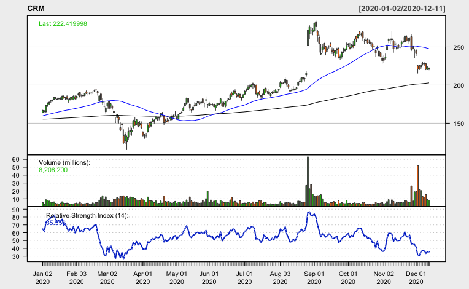

## Health Care: IDEXX Laboratories, Inc (IDXX)

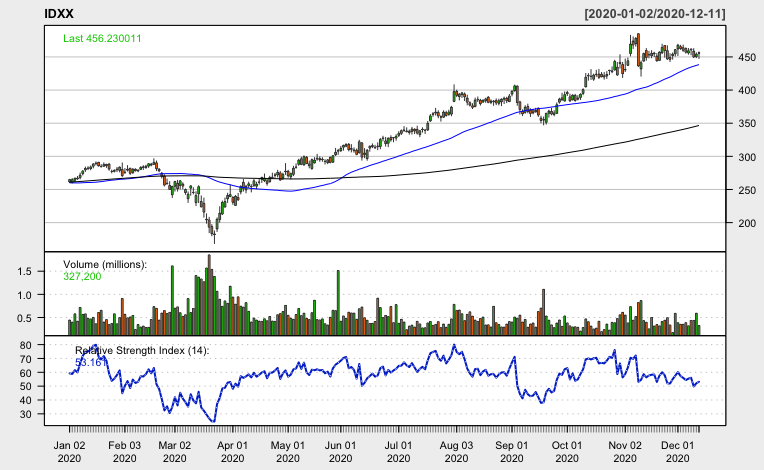

## Consumer Discretionary: Gap Inc (GPS)

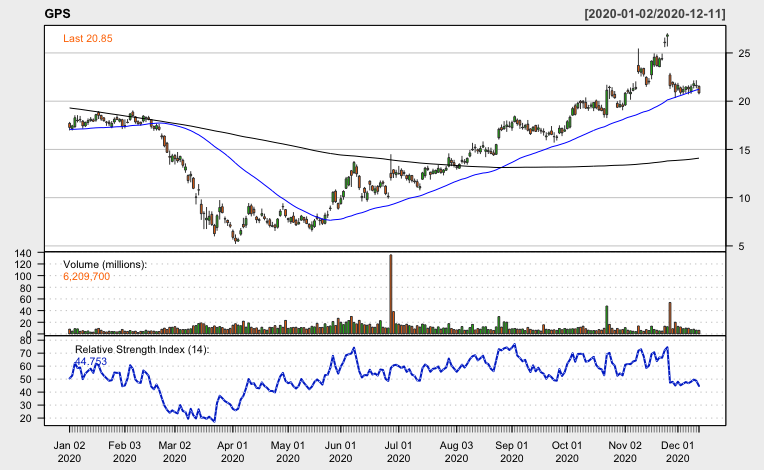

## Communication Services: Charter Communications Inc (CHTR)

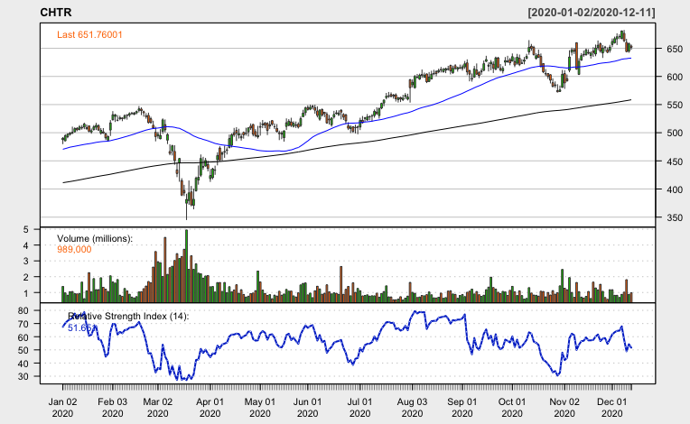

## Financials: Assurant, Inc (AIZ)

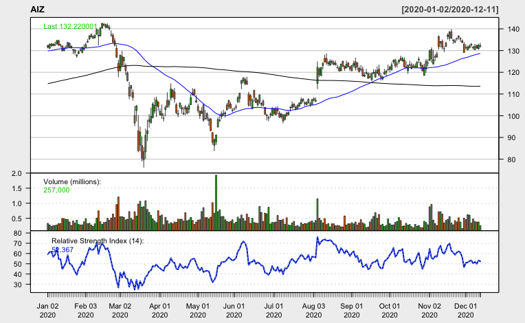

## Industrials: FedEx Corporation (FDX)

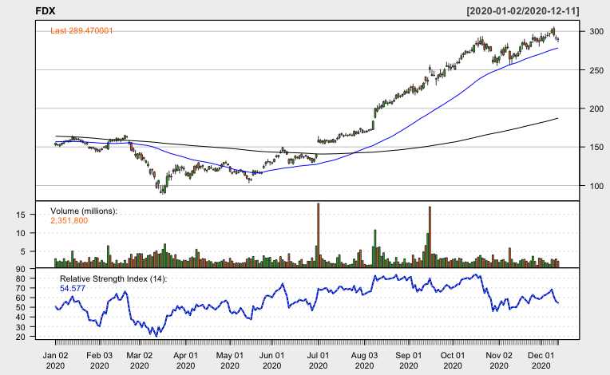

## Consumer Staples: Procter & Gamble Co (PG)

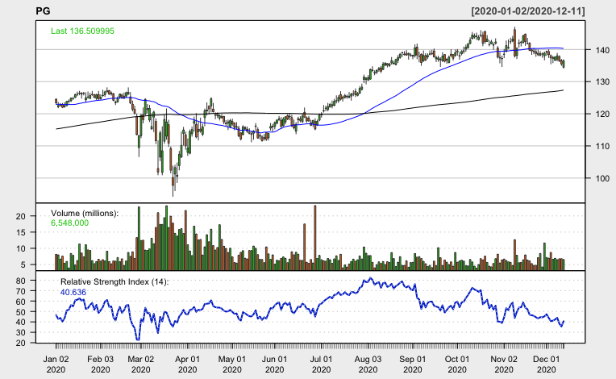

## Utilities: CenterPoint Energy Inc (CNP)

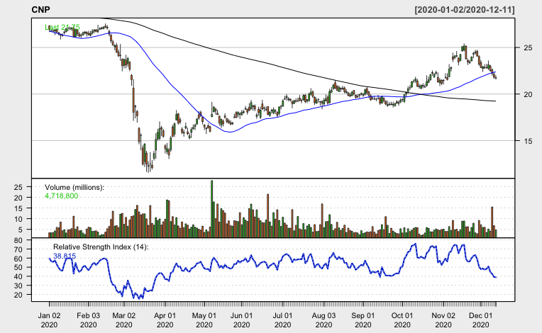

## Real Estate: Ventas, Inc (VTR)

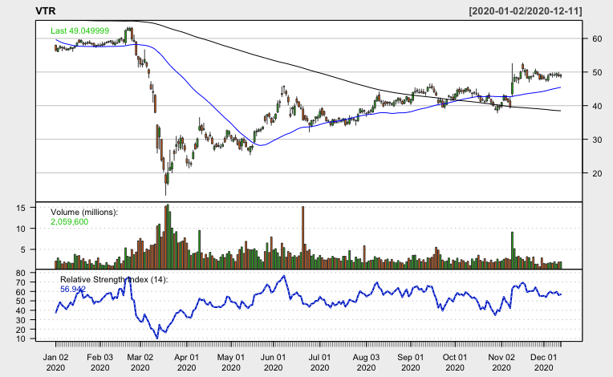

## Materials: Celanese Corporation (CE)

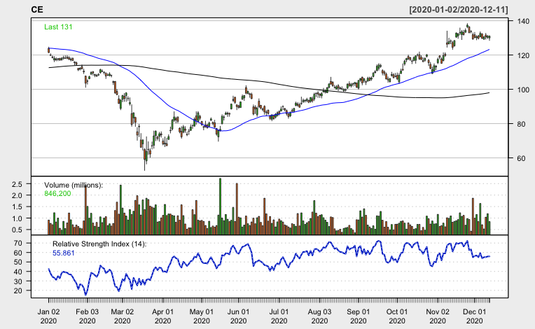

## Energy: Baker Hughes Co (BKR)

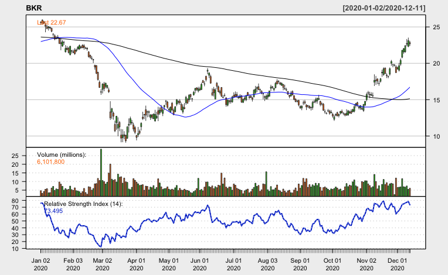

Disclaimer: We are not registered as a securities broker-dealer or an investment adviser either with the U.S. Securities and Exchange Commission (the “SEC”) or with any state securities regulatory authority. We are neither licensed nor qualified to provide investment advice. Do not base any investment decision upon any material found on this website.