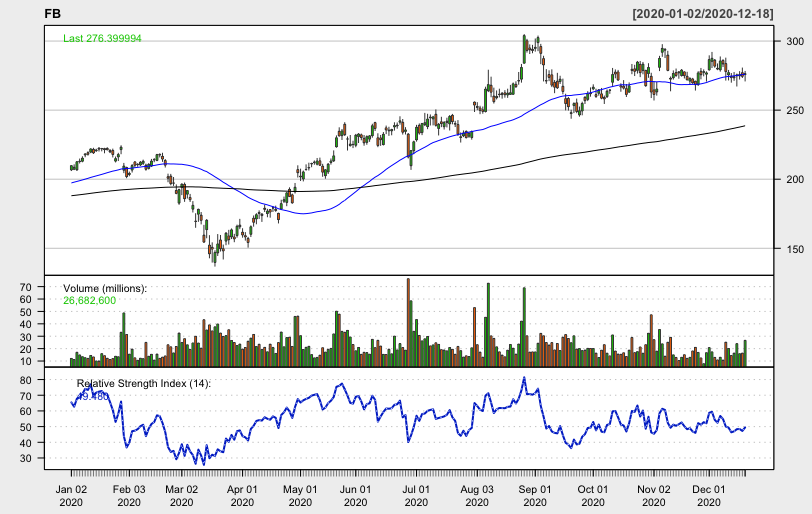

I've written an R program that uses Moving Average ratios weighted by Relative Strength Index to find large-cap stocks with strong momentum at optimal buying times. In a weekly blog series, I will give my program's "pick of the week" in addition to its favorite stock from every other GICS sector. Every post will update how my stocks have performed relative to indices, a strong indicator of success.

## Recap

Week four saw a minor gain of .01%, as compared to the S&P's gain of .45%. Salesforce, my algorithm's pick of the week, had a strong week, gaining around two percent. Seven of the eleven picks were profitable on the week, the strongest being IDXX with a weekly gain of over six percent. Here's how each individual stock performed:

To track this algorithm's overall performance, I started with $11,000 split evenly between the eleven GICS sectors. Each week, the value of the portfolio will be calculated and redistributed evenly between the eleven new stocks. After week three, here is how my algorithm's portolio stands as compared to the S&P 500:

The portfolio generated by this algorithm found itself up a dollar, as compared to SPX's $50 gain. Overall, my portfolio is up 3.05% while the S&P 500 is up 1.49%.

## Pick of the week: FedEx Corporation (FDX)

My algorithm's pick of the week is FedEx Corporation, an Industrials stock that has had an incredible year. Heightened online retail has meant a drastic increase in demand for FedEx, which has pushed to all-time highs at several points this year. After reporting earnings of $4.87 a share (as compared to $3.05 a share the same quarter of 2019), FedEx pulled back 5.7%. This could represent an ideal buying opportunity for a quickly growing company that figures to see its heightened demand continue well past the pandemic.

## Information Technology: Salesforce, Inc (CRM)

## Health Care: Steris PLC (STE)

## Consumer Discretionary: Gap Inc (GPS)

## Communication Services: Facebook Inc (FB)

## Financials: KeyCorp (KEY)

## Consumer Staples: Church & Dwight Co., Inc (CHD)

## Utilities: Entergy Corporation (ETR)

## Real Estate: Crown Castle International Corp (CCI)

## Materials: Freeport-McMoRan Inc (FCX)

## Energy: Baker Hughes Co (BKR)

Disclaimer: We are not registered as a securities broker-dealer or an investment adviser either with the U.S. Securities and Exchange Commission (the “SEC”) or with any state securities regulatory authority. We are neither licensed nor qualified to provide investment advice. Do not base any investment decision upon any material found on this website.