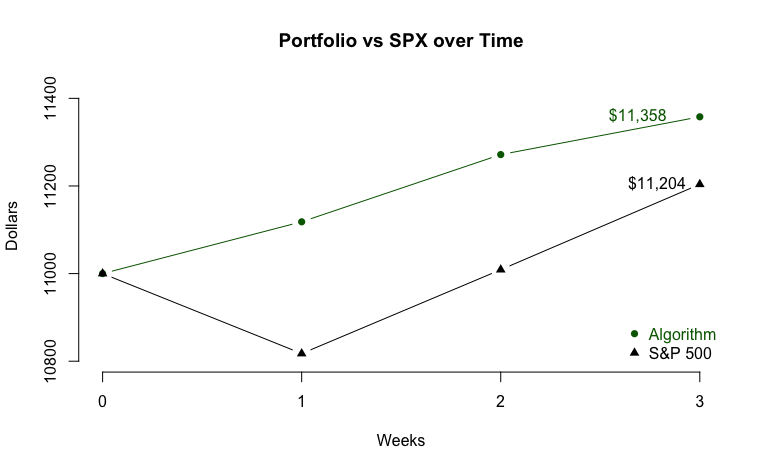

I've written an R program that uses Moving Average ratios weighted by Relative Strength Index to find large-cap stocks with strong momentum at optimal buying times. In a weekly blog series, I will give my program's "pick of the week" in addition to its favorite stock from every other GICS sector. Every post will update how my stocks have performed relative to indices, a strong indicator of success.

## Recap

Week three saw profits, though this algorithm was outperformed by the S&P index by over one percentage point. Gap, my algorithm's pick of the week, had a poor week, falling  over a percent. Seven of the eleven picks were profitable on the week, the strongest being WMB with a weekly gain of over four percent. Here's how each individual stock performed:

To track this algorithm's overall performance, I started with $11,000 split evenly between the eleven GICS sectors. Each week, the value of the portfolio will be calculated and redistributed evenly between the eleven new stocks. After week three, here is how my algorithm's portolio stands as compared to the S&P 500:

The portfolio generated by this algorithm found itself up .77% this week and made $86.23, as compared to SPX's 1.77% gain. Overall, my portfolio is up 3.25% while the S&P 500 is up 1.8%.

## Pick of the week: Gap Inc (GPS)

My algorithm's pick of the week is the same as last week: Gap Inc, a Consumer Discretionary stock that is a well-known clothing retailer. Since bottoming in late-March at just over $5, this stock has been on an absolute tear and quintupled from its lows. Gap pulled back after its earnings call last week which suggested its stock price had overgrown its financials. Optimism around Gap stems from growth in its Old Navy and Athleta lines. While Gap disappointed as this algorithm's pick of the week in week three, this algorithm has faith that last week was a temporary setback and that Gap will continue its uptrend.

## Information Technology: Salesforce, Inc (CRM)

## Health Care: Mettler-Toledo International Inc (MTD)

## Communication Services: Charter Communications Inc (CHTR)

## Financials: Assurant, Inc (AIZ)

## Industrials: Quanta Services Inc (PWR)

## Consumer Staples: Costco Wholesale Corporation (COST)

## Utilities: American Water Works Company Inc (AWK)

## Real Estate: Ventas, Inc (VTR)

## Materials: Celanese Corporation (CE)

## Energy: Cabot Oil & Gas Corporation (COG)

Disclaimer: We are not registered as a securities broker-dealer or an investment adviser either with the U.S. Securities and Exchange Commission (the “SEC”) or with any state securities regulatory authority. We are neither licensed nor qualified to provide investment advice. Do not base any investment decision upon any material found on this website.