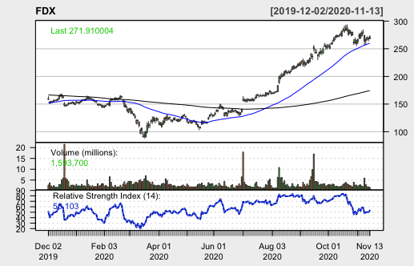

I've written an R program that uses moving-average ratios paired with a stock's relative-strength index to find large-cap stocks with strong momentum at optimal buying times. In each blog post, I will give my program's "pick of the week" in addition to my program's favorite stock from each GICS sector, since equity movement is so tied to sector. Each post will update how the picks have performed relative to sector indices, a strong indicator of success.

## Pick of the week: FDX

Hello let's test this

As you can see, FDX is on a strong general uptrend, suffering a recent pullback. RSI has dropped below 50, representing a strong time to get in on the action blah blah blah